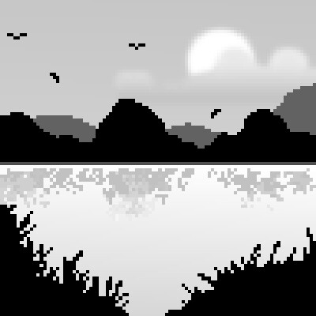

# Hi, I'm Konrad `</>`

I'm a QA Software Tester from Warsaw, Poland.

 

*  I'm passionate about test automation, web applications and video games development.

* 🎓 Recently I've been learning to use Playwright for automated tests on my Django app.

*  One of my dreams is to create a nomadic survival pixel-art game in Godot.

 

